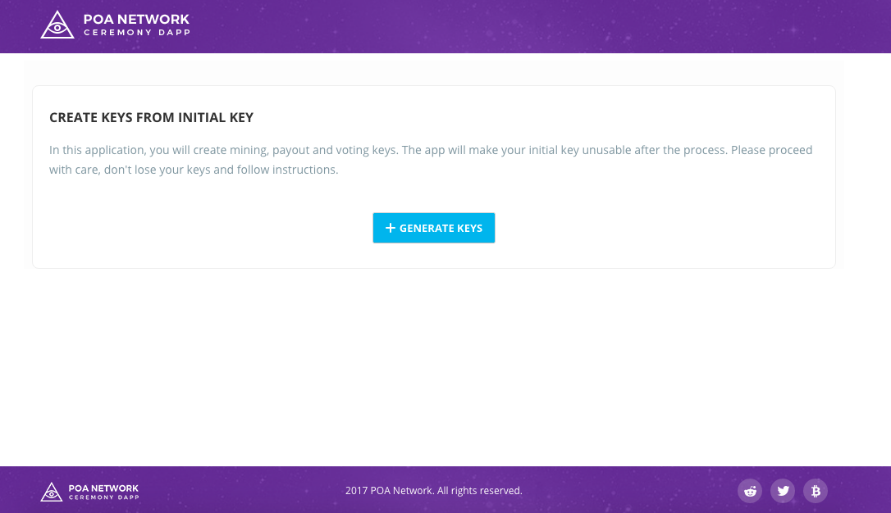
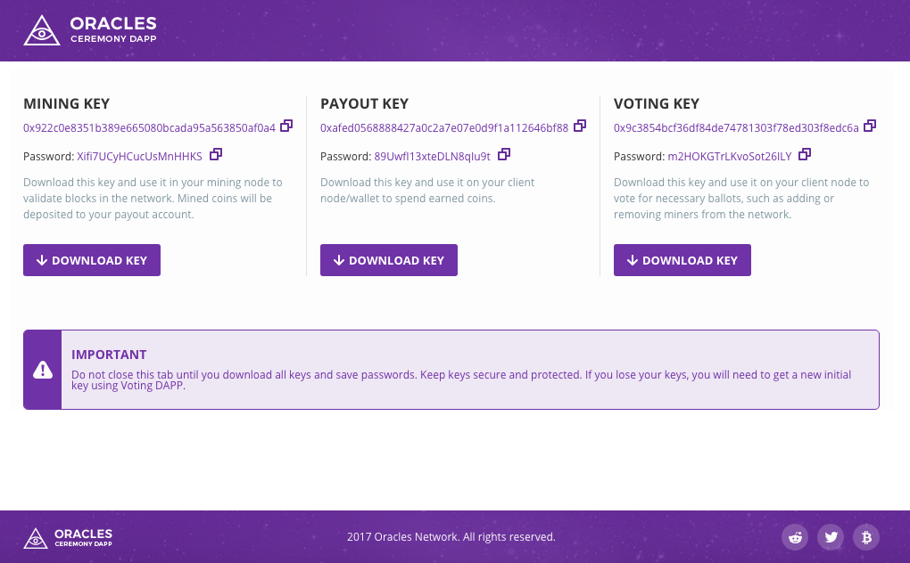

# POA Network Ceremony Dapp

## Supported browsers

* Google Chrome v 59.0.3071.115+

## MetaMask plugin setup

* Connect to POA Network in MetaMask (See [Connect to POA Network via MetaMask](https://github.com/poanetwork/wiki/wiki/POA-Network-on-MetaMask)) or Nifty Wallet extensions (See [Connect to POA Network via Nifty Wallet](https://github.com/poanetwork/wiki/wiki/POA-Network-on-Nifty-Wallet))

* Import your initial key to MetaMask or to Nifty Wallet extensions: browse keystore file, received from invitation, and enter password for the key (See Importing of keys section [in MetaMask](https://github.com/poanetwork/wiki/wiki/POA-Network-on-MetaMask#importing-of-keys) or [in Nifty Wallet](https://github.com/poanetwork/wiki/wiki/POA-Network-on-Nifty-Wallet#importing-of-keys)).

## Ceremony Dapp lifecycle

Check [Ceremony Dapp section from white paper](https://github.com/poanetwork/wiki/wiki/POA-Network-Whitepaper#initial-ceremony-dapp)

## Initial page


## Results page


## Configuration file
It is configured with [POA Network governance smart contracts](https://github.com/poanetwork/poa-network-consensus-contracts)

Path: [`./src/addresses.js`](./src/addresses.js)

```
module.exports = {
  KEYS_MANAGER_ADDRESS: '0xfc90125492e58dbfe80c0bfb6a2a759c4f703ca8'
}
```

## Building from source

1) `npm i`

2) `npm start`
